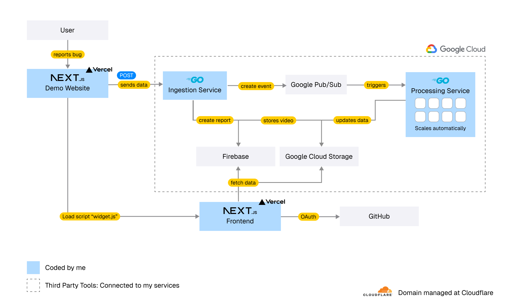

**CatchFrame: Bug Reporting Tool**

CatchFrame is a simple bug reporting tool that records a user's screen, so you can see exactly what went wrong.  It’s the easiest way to get bug reports that actually help you solve problems faster.

Just add **one line of code** to your website, and let your users show you the problem.

---

## Live Links

| Type | URL |
|------|-----|
| **Live Dashboard** | [app.catchframe.app](https://app.catchframe.app) |
| **Demo Site (to find bugs)** | [demo.catchframe.app](https://demo.catchframe.app) |

---

## 💥 The Problem

> “The button doesn’t work.” 
> “I can’t see anything.”

Every developer knows the pain of vague bug reports like these.  
They don’t tell you what’s really happening. So you waste hours asking follow-up questions, guessing browsers, and trying to reproduce bugs.

This **breaks the feedback loop**, especially during beta testing, turning a simple fix into a slow, frustrating process.

---

## 🧩 The Solution: A Perfect Report, Every Time

CatchFrame changes the game.  
Why ask users to describe the problem when they can **show you**?

When a user spots a bug, they click the **CatchFrame widget** and record their screen.  
You instantly get a complete, developer-ready report in your team’s dashboard.

Each CatchFrame report includes:

- 🎥 **A video** of what the user did  
- 🧾 **Console logs** and background errors  
- 🌐 **Failed network requests**  
- 💻 **Browser & OS details**

Understand the problem in **minutes, not days**.

---

## How It’s Built (Architecture)

CatchFrame runs on a **microservices architecture** for speed, scalability, and reliability. It uses Knative and is event driven.
Each service handles a specific task, communicating asynchronously through events.

  

### The Services

#### Ingestion Service (Go)
Handles all incoming bug reports.
It saves raw data instantly and queues background jobs for processing, all within milliseconds.

#### Processing Service (Go)
Processes reports asynchronously, uploading videos, preparing them for viewing, and enriching report data.

#### Admin UI (Next.js)
The control center.  
Developers can log in via GitHub, view incoming reports, and track their status.

#### Demo Website (Next.js)
A playground with intentionally broken buttons, perfect for demonstrating how CatchFrame works.

---

## Report Status Workflow

Every report is tracked like a mini to-do item:

| Status | Description |
|--------|--------------|
| **Pending** | Video is being processed |
| **New** | Ready for review |
| **Processing** | Developer is working on it |
| **Completed** | Bug has been fixed |

---

## ⚡ How to Use

Adding CatchFrame to any website takes **seconds**.

### HTML
```html
<script src="https://app.catchframe.app/scripts/widget.js" defer></script>
```

### Next.js
```jsx
<Script src="https://app.catchframe.app/scripts/widget.js" />
```

That’s it!  
The widget will appear automatically, and users can start sending perfect bug reports.

---

## 🚀 The Future (Roadmap)

Here are some ideas what could be integrated and added in future.

- **Slack & Teams Integration**: Get bug reports directly in your team’s chat.  
- **AI-Powered Summaries**: Let AI analyze logs and suggest likely causes.  
- **Jira & Linear Integration**: Auto-create tickets with full bug context.  
- **Team Collaboration Tools**: Assign reports, leave comments, and track progress.

---

## 🧠 Running Locally

### Prerequisites
- [pnpm](https://pnpm.io/)
- [Go](https://go.dev/)

### Clone the Repository
```bash
git clone https://github.com/noahediz/acta-hackathon-catchframe.git
cd acta-hackathon-catchframe
```

### Install & Start

**Web UI**
```bash
pnpm install:web
pnpm start:web
```

**Demo Site**
```bash
pnpm install:demo
pnpm start:demo
```

### Backend Services
```bash
cd services/ingestion   # or services/processing
go run main.go
```

---

  
  
